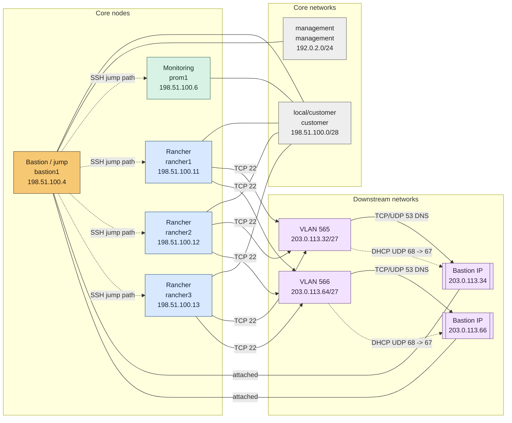

# Desired Topology: full-example

> Status: desired configuration only; runtime state and reachability are not verified.

## ASCII Overview

```text
Desired topology: full-example
External jump: not represented in desired topology
|
Bastion: bastion1 (198.51.100.4)
+-- local/customer customer: 198.51.100.0/28
+-- management management: 192.0.2.0/24
+-- downstream VLAN 565: 203.0.113.32/27, bastion 203.0.113.34
+-- downstream VLAN 566: 203.0.113.64/27, bastion 203.0.113.66

Core nodes:
- prometheus: prom1 (198.51.100.6)
- rancher: rancher1 (198.51.100.11)
- rancher: rancher2 (198.51.100.12)
- rancher: rancher3 (198.51.100.13)

Connectivity:
- vlan565 (203.0.113.32/27) -> bastion1:vlan565 (203.0.113.34): TCP/UDP 53
- rancher1 (198.51.100.11), rancher2 (198.51.100.12), rancher3 (198.51.100.13) -> vlan565 (203.0.113.32/27): TCP 22
- vlan565 (203.0.113.32/27) -> bastion1:vlan565 (203.0.113.34): UDP 68 -> 67
- vlan566 (203.0.113.64/27) -> bastion1:vlan566 (203.0.113.66): TCP/UDP 53
- rancher1 (198.51.100.11), rancher2 (198.51.100.12), rancher3 (198.51.100.13) -> vlan566 (203.0.113.64/27): TCP 22
- vlan566 (203.0.113.64/27) -> bastion1:vlan566 (203.0.113.66): UDP 68 -> 67
```

## Mermaid Topology



## Environment Overview

| Environment | Rancher URL | Domain | RKE2 | Rancher | cert-manager |
| --- | --- | --- | --- | --- | --- |
| full-example | rancher.full-example.example.invalid | full-example.example.invalid | v1.35.7+rke2r1 | 2.14.4 | v1.21.1 |

## Hosts And Roles

| Host | FQDN | Roles | Local IP | Management IP | SSH target |
| --- | --- | --- | --- | --- | --- |
| bastion1 | bastion1.rancher.full-example.example.invalid | bastion | 198.51.100.4 | 192.0.2.10 | 192.0.2.10 |
| prom1 | prom1.rancher.full-example.example.invalid | prometheus | 198.51.100.6 | unknown | 198.51.100.6 |
| rancher1 | rancher1.rancher.full-example.example.invalid | rancher | 198.51.100.11 | unknown | 198.51.100.11 |
| rancher2 | rancher2.rancher.full-example.example.invalid | rancher | 198.51.100.12 | unknown | 198.51.100.12 |
| rancher3 | rancher3.rancher.full-example.example.invalid | rancher | 198.51.100.13 | unknown | 198.51.100.13 |

## Interfaces

| Host | Interface | Network | Kind | Address | Addressing |
| --- | --- | --- | --- | --- | --- |
| bastion1 | customer | customer | local/customer | 198.51.100.4/28 | static |
| bastion1 | management | management | management | 192.0.2.10/24 | static |
| prom1 | customer | customer | local/customer | 198.51.100.6/28 | static |
| rancher1 | customer | customer | local/customer | 198.51.100.11/28 | static |
| rancher2 | customer | customer | local/customer | 198.51.100.12/28 | static |
| rancher3 | customer | customer | local/customer | 198.51.100.13/28 | static |
| bastion1 | vlan565 | downstream:vlan565 | downstream | 203.0.113.34/27 | static |
| bastion1 | vlan566 | downstream:vlan566 | downstream | 203.0.113.66/27 | static |

## Bastion Services

Host bastion1 provides jump-host, DNS, DHCP, and proxy capabilities.

| Service | Network | Endpoint | Proto/Port | Purpose |
| --- | --- | --- | --- | --- |
| proxy | customer | 198.51.100.4 | TCP 3128 | HTTP and HTTPS forward proxy for local services |
| dns | customer | 198.51.100.4 | TCP/UDP 53 | DNS for local nodes |
| dns | downstream:vlan565 | 203.0.113.34 | TCP/UDP 53 | DNS for downstream nodes on the same VLAN |
| dhcp | downstream:vlan565 | 203.0.113.34 | UDP 67/68 | DHCP for downstream nodes on the same VLAN |
| dns | downstream:vlan566 | 203.0.113.66 | TCP/UDP 53 | DNS for downstream nodes on the same VLAN |
| dhcp | downstream:vlan566 | 203.0.113.66 | UDP 67/68 | DHCP for downstream nodes on the same VLAN |

## Networks

| Network | Kind | VMware network | CIDR | VLAN | Gateway |
| --- | --- | --- | --- | --- | --- |
| customer | local/customer | EXAMPLE_CUSTOMER_NETWORK | 198.51.100.0/28 | - | 198.51.100.1 |
| management | management | EXAMPLE_MANAGEMENT_NETWORK | 192.0.2.0/24 | - | unknown |
| downstream:vlan565 | downstream | EXAMPLE_DOWNSTREAM_NETWORK_565 | 203.0.113.32/27 | 565 | 203.0.113.33 |
| downstream:vlan566 | downstream | EXAMPLE_DOWNSTREAM_NETWORK_566 | 203.0.113.64/27 | 566 | 203.0.113.65 |

## Downstream Networks

| VLAN | VMware network | CIDR | Bastion IP | Gateway | DHCP pool | Lease |
| --- | --- | --- | --- | --- | --- | --- |
| 565 | EXAMPLE_DOWNSTREAM_NETWORK_565 | 203.0.113.32/27 | 203.0.113.34 | 203.0.113.33 | 203.0.113.36-203.0.113.61 | 12h |
| 566 | EXAMPLE_DOWNSTREAM_NETWORK_566 | 203.0.113.64/27 | 203.0.113.66 | 203.0.113.65 | 203.0.113.68-203.0.113.93 | 12h |

## Connectivity Requirements

| Source | Destination | Proto/Port | Purpose | Requirement | Verification |
| --- | --- | --- | --- | --- | --- |
| vlan565 (203.0.113.32/27) | bastion1:vlan565 (203.0.113.34) | TCP/UDP 53 | DNS for downstream nodes | RINSTALL_ARCHITECTURE | external/unverified |
| rancher1 (198.51.100.11), rancher2 (198.51.100.12), rancher3 (198.51.100.13) | vlan565 (203.0.113.32/27) | TCP 22 | Administrator SSH from Rancher nodes to downstream nodes | RINSTALL_ARCHITECTURE | external/unverified |
| vlan565 (203.0.113.32/27) | bastion1:vlan565 (203.0.113.34) | UDP 68 -> 67 | Downstream DHCP request | RINSTALL_CODE+UPSTREAM_PROTOCOL | external/unverified |
| bastion1:vlan565 (203.0.113.34) | vlan565 (203.0.113.32/27) | UDP 67 -> 68 | Downstream DHCP response | RINSTALL_CODE+UPSTREAM_PROTOCOL | external/unverified |
| vlan566 (203.0.113.64/27) | bastion1:vlan566 (203.0.113.66) | TCP/UDP 53 | DNS for downstream nodes | RINSTALL_ARCHITECTURE | external/unverified |
| rancher1 (198.51.100.11), rancher2 (198.51.100.12), rancher3 (198.51.100.13) | vlan566 (203.0.113.64/27) | TCP 22 | Administrator SSH from Rancher nodes to downstream nodes | RINSTALL_ARCHITECTURE | external/unverified |
| vlan566 (203.0.113.64/27) | bastion1:vlan566 (203.0.113.66) | UDP 68 -> 67 | Downstream DHCP request | RINSTALL_CODE+UPSTREAM_PROTOCOL | external/unverified |
| bastion1:vlan566 (203.0.113.66) | vlan566 (203.0.113.64/27) | UDP 67 -> 68 | Downstream DHCP response | RINSTALL_CODE+UPSTREAM_PROTOCOL | external/unverified |

## Notes / Unknowns

- Desired topology only; provider state, guest runtime state, and network reachability are not verified.
