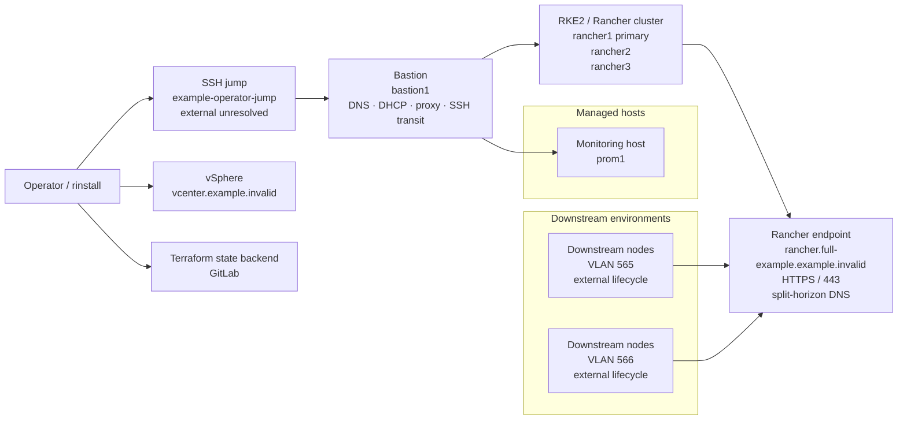
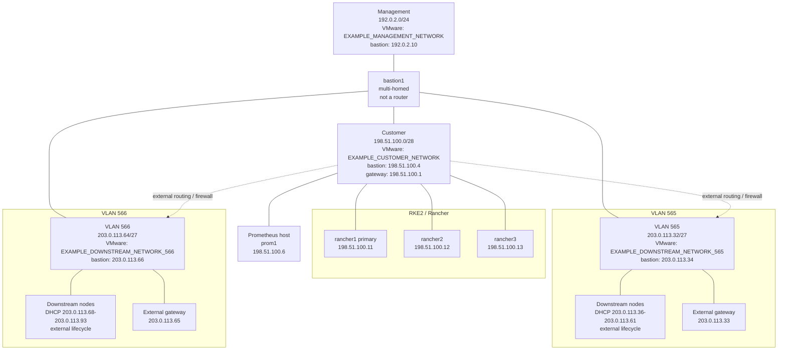

# Desired Topology: full-example

> Status: desired configuration only; runtime state and network reachability are not verified.
> External dependencies may be unresolved; downstream lifecycle is external; the bastion is not the downstream router.

## Architecture Map

## Network Topology

## Endpoint Resolution

| Endpoint | Scope | Desired resolution |
| --- | --- | --- |
| https://rancher.full-example.example.invalid:443 | internal / rinstall DNS | rancher1 198.51.100.11, rancher2 198.51.100.12, rancher3 198.51.100.13 |
| https://rancher.full-example.example.invalid:443 | external DNS | external VIP/LB - unresolved |

## Environment

| Environment | Rancher URL | Domain | RKE2 | Rancher | cert-manager |
| --- | --- | --- | --- | --- | --- |
| full-example | rancher.full-example.example.invalid | full-example.example.invalid | v1.35.7+rke2r1 | 2.14.4 | v1.21.1 |

## Deployment Context

| Property | Desired value |
| --- | --- |
| vCenter endpoint | vcenter.example.invalid |
| Datacenter | EXAMPLE_DATACENTER |
| Resource pool | EXAMPLE_CLUSTER/Resources |
| Datastore | EXAMPLE_DATASTORE |
| VM folder | Rancher/full-example |
| Clone timeout | 60 minutes |
| TLS verification | enabled |
| Terraform backend | gitlab (full-example-infra) |
| Template: infra | EXAMPLE_TEMPLATE_INFRA |
| Template: rke2 | EXAMPLE_TEMPLATE_RKE2 |
| VMware network: customer | EXAMPLE_CUSTOMER_NETWORK |
| VMware network: management | EXAMPLE_MANAGEMENT_NETWORK |
| VMware network: downstream:vlan565 | EXAMPLE_DOWNSTREAM_NETWORK_565 |
| VMware network: downstream:vlan566 | EXAMPLE_DOWNSTREAM_NETWORK_566 |

## Hosts and Clusters

| Component | Desired addresses / membership | SSH target |
| --- | --- | --- |
| Bastion: bastion1 | customer 198.51.100.4; management 192.0.2.10 | 192.0.2.10 |
| Monitoring: prom1 | 198.51.100.6 | 198.51.100.6 |
| RKE2 / Rancher cluster | rancher1 (primary), rancher2 (member), rancher3 (member) | - |

## Networks

| Network | Kind | CIDR | VMware network | VLAN | Bastion IP | Gateway | DHCP |
| --- | --- | --- | --- | --- | --- | --- | --- |
| customer | local/customer | 198.51.100.0/28 | EXAMPLE_CUSTOMER_NETWORK | - | 198.51.100.4 | 198.51.100.1 | - |
| management | management | 192.0.2.0/24 | EXAMPLE_MANAGEMENT_NETWORK | - | 192.0.2.10 | - | - |
| downstream:vlan565 | downstream | 203.0.113.32/27 | EXAMPLE_DOWNSTREAM_NETWORK_565 | 565 | 203.0.113.34 | 203.0.113.33 | 203.0.113.36-203.0.113.61 |
| downstream:vlan566 | downstream | 203.0.113.64/27 | EXAMPLE_DOWNSTREAM_NETWORK_566 | 566 | 203.0.113.66 | 203.0.113.65 | 203.0.113.68-203.0.113.93 |

## Key Connectivity

### Administrative

| Source | Destination | Transport | Purpose |
| --- | --- | --- | --- |
| bastion1 | prom1 | TCP * -&gt; 22 | Administrative SSH path segment |
| bastion1 | rancher1 | TCP * -&gt; 22 | Administrative SSH path segment |
| bastion1 | rancher2 | TCP * -&gt; 22 | Administrative SSH path segment |
| bastion1 | rancher3 | TCP * -&gt; 22 | Administrative SSH path segment |
| SSH jump | bastion1 | TCP * -&gt; 22 | Administrative SSH path segment |
| Operator / rinstall | SSH jump | TCP | Administrative SSH path segment |

### Deployment

| Source | Destination | Transport | Purpose |
| --- | --- | --- | --- |
| Operator / rinstall | Terraform backend | TCP * -&gt; 443 | Operator Terraform uses the configured GitLab HTTP backend |
| Operator / rinstall | vCenter API | TCP * -&gt; 443 | Operator Terraform uses the vCenter provider API |

### Core services

| Source | Destination | Transport | Purpose |
| --- | --- | --- | --- |
| bastion1 | 192.0.2.53 | TCP/UDP * -&gt; 53 | Bastion operating system uses configured management DNS resolvers |
| prom1, rancher1, rancher2, rancher3 | 198.51.100.4 | TCP/UDP * -&gt; 53 | Local nodes use their effective configured DNS servers |
| Bastion DNS | Upstream DNS | TCP/UDP * -&gt; 53 | Bastion DNS forwards to configured upstream resolvers |
| rancher1, rancher2, rancher3 | Bastion Squid proxy | TCP * -&gt; 3128 | RKE2 and Rancher nodes use configured bastion Squid proxy |
| Bastion Squid proxy | external repositories and service endpoints | TCP * -&gt; 80/443 | Squid reaches required external repositories and service endpoints |

### RKE2 / Rancher

| Source | Destination | Transport | Purpose |
| --- | --- | --- | --- |
| bastion1 | rancher1 | TCP * -&gt; 6443 | Bastion administrative tooling uses the primary Kubernetes API |
| rancher2, rancher3 | rancher1 | TCP * -&gt; 9345 | RKE2 server join connection to primary |

### Downstream

| Source | Destination | Transport | Purpose |
| --- | --- | --- | --- |
| Downstream nodes (VLAN 565) | Same-VLAN bastion DHCP | UDP 68 -&gt; 67 | Authoritative same-VLAN dnsmasq DHCP request; initial requests may broadcast |
| Downstream nodes (VLAN 566) | Same-VLAN bastion DHCP | UDP 68 -&gt; 67 | Authoritative same-VLAN dnsmasq DHCP request; initial requests may broadcast |
| Same-VLAN bastion DHCP | Downstream nodes (VLAN 565) | UDP 67 -&gt; 68 | Authoritative same-VLAN dnsmasq DHCP response |
| Same-VLAN bastion DHCP | Downstream nodes (VLAN 566) | UDP 67 -&gt; 68 | Authoritative same-VLAN dnsmasq DHCP response |
| Downstream nodes (VLAN 565) | Bastion DNS | TCP/UDP * -&gt; 53 | DNS for downstream nodes |
| Downstream nodes (VLAN 566) | Bastion DNS | TCP/UDP * -&gt; 53 | DNS for downstream nodes |
| Downstream nodes (VLAN 565) | Rancher endpoint | TCP * -&gt; 443 | Downstream Rancher agents connect to the locally resolved Rancher endpoint |
| Downstream nodes (VLAN 566) | Rancher endpoint | TCP * -&gt; 443 | Downstream Rancher agents connect to the locally resolved Rancher endpoint |
| Customer network | VLAN 565 | external routing / firewall | Customer/downstream traffic depends on external routing and firewalling; bastion is not the router |
| Customer network | VLAN 566 | external routing / firewall | Customer/downstream traffic depends on external routing and firewalling; bastion is not the router |
| rancher1, rancher2, rancher3 | Downstream nodes (VLAN 565) | TCP * -&gt; 22 | Administrator SSH from Rancher nodes to downstream nodes |
| rancher1, rancher2, rancher3 | Downstream nodes (VLAN 566) | TCP * -&gt; 22 | Administrator SSH from Rancher nodes to downstream nodes |

## Resolved Connectivity

### Administrative

| Category | Source | Destination | Transport | Purpose | Resolution | Verification |
| --- | --- | --- | --- | --- | --- | --- |
| Administrative | bastion1 | prom1 | TCP * -&gt; 22 | Administrative SSH path segment | 198.51.100.4, 198.51.100.6 | unverified |
| Administrative | bastion1 | rancher1 | TCP * -&gt; 22 | Administrative SSH path segment | 198.51.100.4, 198.51.100.11 | unverified |
| Administrative | bastion1 | rancher2 | TCP * -&gt; 22 | Administrative SSH path segment | 198.51.100.4, 198.51.100.12 | unverified |
| Administrative | bastion1 | rancher3 | TCP * -&gt; 22 | Administrative SSH path segment | 198.51.100.4, 198.51.100.13 | unverified |
| Administrative | SSH jump | bastion1 | TCP * -&gt; 22 | Administrative SSH path segment | 192.0.2.10 | unverified |
| Administrative | Operator / rinstall | SSH jump | TCP | Administrative SSH path segment | symbolic / unresolved | unverified |

### Deployment

| Category | Source | Destination | Transport | Purpose | Resolution | Verification |
| --- | --- | --- | --- | --- | --- | --- |
| Deployment | Operator / rinstall | Terraform backend | TCP * -&gt; 443 | Operator Terraform uses the configured GitLab HTTP backend | https://gitlab.example.invalid | unverified |
| Deployment | Operator / rinstall | vCenter API | TCP * -&gt; 443 | Operator Terraform uses the vCenter provider API | vcenter.example.invalid | unverified |

### Core services

| Category | Source | Destination | Transport | Purpose | Resolution | Verification |
| --- | --- | --- | --- | --- | --- | --- |
| Core services | bastion1 | 192.0.2.53 | TCP/UDP * -&gt; 53 | Bastion operating system uses configured management DNS resolvers | 192.0.2.10, 192.0.2.53 | unverified |
| Core services | prom1, rancher1, rancher2, rancher3 | 198.51.100.4 | TCP/UDP * -&gt; 53 | Local nodes use their effective configured DNS servers | 198.51.100.6, 198.51.100.11, 198.51.100.12, 198.51.100.13, 198.51.100.4 | unverified |
| Core services | Bastion DNS | Upstream DNS | TCP/UDP * -&gt; 53 | Bastion DNS forwards to configured upstream resolvers | 192.0.2.10, 192.0.2.54, 192.0.2.55 | unverified |
| Core services | rancher1, rancher2, rancher3 | Bastion Squid proxy | TCP * -&gt; 3128 | RKE2 and Rancher nodes use configured bastion Squid proxy | 198.51.100.11, 198.51.100.12, 198.51.100.13, 198.51.100.4 | unverified |
| Core services | Bastion Squid proxy | external repositories and service endpoints | TCP * -&gt; 80/443 | Squid reaches required external repositories and service endpoints | symbolic / unresolved | unverified |

### RKE2 / Rancher

| Category | Source | Destination | Transport | Purpose | Resolution | Verification |
| --- | --- | --- | --- | --- | --- | --- |
| RKE2 / Rancher | bastion1 | rancher1 | TCP * -&gt; 6443 | Bastion administrative tooling uses the primary Kubernetes API | 198.51.100.4, 198.51.100.11 | unverified |
| RKE2 / Rancher | rancher2, rancher3 | rancher1 | TCP * -&gt; 9345 | RKE2 server join connection to primary | 198.51.100.12, 198.51.100.13, 198.51.100.11 | unverified |

### Downstream

| Category | Source | Destination | Transport | Purpose | Resolution | Verification |
| --- | --- | --- | --- | --- | --- | --- |
| Downstream | Downstream nodes (VLAN 565) | Same-VLAN bastion DHCP | UDP 68 -&gt; 67 | Authoritative same-VLAN dnsmasq DHCP request; initial requests may broadcast | same-L2 service intent | unverified |
| Downstream | Downstream nodes (VLAN 566) | Same-VLAN bastion DHCP | UDP 68 -&gt; 67 | Authoritative same-VLAN dnsmasq DHCP request; initial requests may broadcast | same-L2 service intent | unverified |
| Downstream | Same-VLAN bastion DHCP | Downstream nodes (VLAN 565) | UDP 67 -&gt; 68 | Authoritative same-VLAN dnsmasq DHCP response | same-L2 service intent | unverified |
| Downstream | Same-VLAN bastion DHCP | Downstream nodes (VLAN 566) | UDP 67 -&gt; 68 | Authoritative same-VLAN dnsmasq DHCP response | same-L2 service intent | unverified |
| Downstream | Downstream nodes (VLAN 565) | Bastion DNS | TCP/UDP * -&gt; 53 | DNS for downstream nodes | 203.0.113.32/27, 203.0.113.34 | unverified |
| Downstream | Downstream nodes (VLAN 566) | Bastion DNS | TCP/UDP * -&gt; 53 | DNS for downstream nodes | 203.0.113.64/27, 203.0.113.66 | unverified |
| Downstream | Downstream nodes (VLAN 565) | Rancher endpoint | TCP * -&gt; 443 | Downstream Rancher agents connect to the locally resolved Rancher endpoint | internal / rinstall DNS: 198.51.100.11, 198.51.100.12, 198.51.100.13 | unverified |
| Downstream | Downstream nodes (VLAN 566) | Rancher endpoint | TCP * -&gt; 443 | Downstream Rancher agents connect to the locally resolved Rancher endpoint | internal / rinstall DNS: 198.51.100.11, 198.51.100.12, 198.51.100.13 | unverified |
| Downstream | Customer network | VLAN 565 | external routing / firewall | Customer/downstream traffic depends on external routing and firewalling; bastion is not the router | 198.51.100.0/28, 203.0.113.32/27 | unverified |
| Downstream | Customer network | VLAN 566 | external routing / firewall | Customer/downstream traffic depends on external routing and firewalling; bastion is not the router | 198.51.100.0/28, 203.0.113.64/27 | unverified |
| Downstream | rancher1, rancher2, rancher3 | Downstream nodes (VLAN 565) | TCP * -&gt; 22 | Administrator SSH from Rancher nodes to downstream nodes | 198.51.100.11, 198.51.100.12, 198.51.100.13, 203.0.113.32/27 | unverified |
| Downstream | rancher1, rancher2, rancher3 | Downstream nodes (VLAN 566) | TCP * -&gt; 22 | Administrator SSH from Rancher nodes to downstream nodes | 198.51.100.11, 198.51.100.12, 198.51.100.13, 203.0.113.64/27 | unverified |

## Details

Interfaces

| Host | Logical interface | Network | Address | Addressing |
| --- | --- | --- | --- | --- |
| bastion1 | customer | customer | 198.51.100.4/28 | static |
| bastion1 | management | management | 192.0.2.10/24 | static |
| prom1 | customer | customer | 198.51.100.6/28 | static |
| rancher1 | customer | customer | 198.51.100.11/28 | static |
| rancher2 | customer | customer | 198.51.100.12/28 | static |
| rancher3 | customer | customer | 198.51.100.13/28 | static |
| bastion1 | vlan565 | downstream:vlan565 | 203.0.113.34/27 | static |
| bastion1 | vlan566 | downstream:vlan566 | 203.0.113.66/27 | static |

Bastion services, routes, and lifecycle notes

- Service: HTTP and HTTPS forward proxy for local services (198.51.100.4)
- Service: DNS for local nodes (198.51.100.4)
- Service: DNS for downstream nodes on the same VLAN (203.0.113.34)
- Service: DHCP for downstream nodes on the same VLAN (203.0.113.34)
- Service: DNS for downstream nodes on the same VLAN (203.0.113.66)
- Service: DHCP for downstream nodes on the same VLAN (203.0.113.66)
- vSphere route: 192.0.2.128/26 via 192.0.2.1

## Notes

- Desired topology only; provider state, guest runtime state, and network reachability are not verified.
- Runtime state, network reachability, and external endpoint reachability are not verified.
- The bastion provides downstream services but is not the downstream router.
