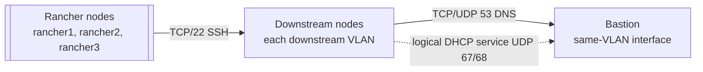

# Desired Topology: full-example

> Status: desired configuration only; runtime state and reachability are not verified.

## Infrastructure Topology

<svg xmlns="http://www.w3.org/2000/svg" role="img" aria-labelledby="title desc" viewBox="0 0 1200 815" width="1200" height="815">
<title id="title">Desired infrastructure topology</title>
<desc id="desc">Environment full-example infrastructure attachment map</desc>
<style>
          .background { fill: #ffffff; }
          .network { fill: #f1f3f5; stroke: #6b7280; stroke-width: 2; }
          .management { fill: #e8eefc; stroke: #4969a8; stroke-width: 2; }
          .bastion { fill: #fff1c7; stroke: #8a6420; stroke-width: 2.5; }
          .host { fill: #ffffff; stroke: #52606d; stroke-width: 2; }
          .rancher { fill: #e5f0ff; stroke: #315a8a; stroke-width: 2; }
          .monitoring { fill: #e4f5eb; stroke: #39735a; stroke-width: 2; }
          .downstream { fill: #f3e8ff; stroke: #76508f; stroke-width: 2; }
          .group { fill: none; stroke: #9aa5b1; stroke-width: 1.5; stroke-dasharray: 7 5; }
          .connector { stroke: #475569; stroke-width: 2.5; fill: none; }
          .heading { font: 600 16px sans-serif; fill: #1f2937; text-anchor: middle; }
          .box-label { font: 13px sans-serif; fill: #17202a; text-anchor: middle; }
          .small-label { font: 12px sans-serif; fill: #4b5563; text-anchor: middle; }
        </style>
<rect class="background" x="0" y="0" width="1200" height="815" />
<rect class="management" x="500.0" y="35" width="200" height="92" rx="10" /><text class="box-label" x="600.0" y="60">Management</text>
<text class="box-label" x="600.0" y="78">192.0.2.0/24</text>
<line class="connector" x1="600.0" y1="127" x2="600.0" y2="165" />
<rect class="bastion" x="500.0" y="165" width="200" height="110" rx="10" /><text class="box-label" x="600.0" y="190">bastion1</text>
<text class="box-label" x="600.0" y="208">customer: 198.51.100.4/28</text>
<text class="box-label" x="600.0" y="226">management: 192.0.2.10/24</text>
<line class="connector" x1="600.0" y1="275" x2="600.0" y2="325" />
<rect class="network" x="500.0" y="325" width="200" height="92" rx="10" /><text class="box-label" x="600.0" y="350">Customer network</text>
<text class="box-label" x="600.0" y="368">198.51.100.0/28</text>
<line class="connector" x1="600.0" y1="417" x2="600.0" y2="452" />
<line class="connector" x1="207.0" y1="452" x2="963.0" y2="452" />
<rect class="monitoring" x="107.0" y="455" width="230" height="92" rx="10" /><text class="box-label" x="222.0" y="480">Monitoring: prom1</text>
<text class="box-label" x="222.0" y="498">198.51.100.6</text>
<line class="connector" x1="207.0" y1="452" x2="207.0" y2="455" />
<rect class="rancher" x="359.0" y="455" width="230" height="92" rx="10" /><text class="box-label" x="474.0" y="480">Rancher: rancher1</text>
<text class="box-label" x="474.0" y="498">198.51.100.11</text>
<line class="connector" x1="459.0" y1="452" x2="459.0" y2="455" />
<rect class="rancher" x="611.0" y="455" width="230" height="92" rx="10" /><text class="box-label" x="726.0" y="480">Rancher: rancher2</text>
<text class="box-label" x="726.0" y="498">198.51.100.12</text>
<line class="connector" x1="711.0" y1="452" x2="711.0" y2="455" />
<rect class="rancher" x="863.0" y="455" width="230" height="92" rx="10" /><text class="box-label" x="978.0" y="480">Rancher: rancher3</text>
<text class="box-label" x="978.0" y="498">198.51.100.13</text>
<line class="connector" x1="963.0" y1="452" x2="963.0" y2="455" />
<rect class="group" x="347.0" y="427" width="758" height="137" rx="8" />
<text class="heading" x="726.0" y="445">Rancher cluster</text>
<text class="heading" x="600.0" y="610">Downstream networks</text>
<line class="connector" x1="700.0" y1="220.0" x2="1125" y2="220.0" />
<line class="connector" x1="1125" y1="220.0" x2="1125" y2="630" />
<line class="connector" x1="315.0" y1="630" x2="885.0" y2="630" />
<line class="connector" x1="885.0" y1="630" x2="1125" y2="630" />
<rect class="downstream" x="40.0" y="642" width="550.0" height="118" rx="10" /><text class="box-label" x="315.0" y="667">VLAN 565</text>
<text class="box-label" x="315.0" y="685">203.0.113.32/27</text>
<text class="box-label" x="315.0" y="703">bastion: 203.0.113.34</text>
<text class="box-label" x="315.0" y="721">gateway: 203.0.113.33</text>
<line class="connector" x1="140.0" y1="630" x2="140.0" y2="642" />
<rect class="downstream" x="610.0" y="642" width="550.0" height="118" rx="10" /><text class="box-label" x="885.0" y="667">VLAN 566</text>
<text class="box-label" x="885.0" y="685">203.0.113.64/27</text>
<text class="box-label" x="885.0" y="703">bastion: 203.0.113.66</text>
<text class="box-label" x="885.0" y="721">gateway: 203.0.113.65</text>
<line class="connector" x1="710.0" y1="630" x2="710.0" y2="642" />
</svg>

## Environment Overview

| Environment | Rancher URL | Domain | RKE2 | Rancher | cert-manager |
| --- | --- | --- | --- | --- | --- |
| full-example | rancher.full-example.example.invalid | full-example.example.invalid | v1.35.7+rke2r1 | 2.14.4 | v1.21.1 |

## Hosts And Roles

| Host | FQDN | Roles | Local IP | Management IP | SSH target |
| --- | --- | --- | --- | --- | --- |
| bastion1 | bastion1.rancher.full-example.example.invalid | bastion | 198.51.100.4 | 192.0.2.10 | 192.0.2.10 |
| prom1 | prom1.rancher.full-example.example.invalid | prometheus | 198.51.100.6 | not attached | 198.51.100.6 |
| rancher1 | rancher1.rancher.full-example.example.invalid | rancher | 198.51.100.11 | not attached | 198.51.100.11 |
| rancher2 | rancher2.rancher.full-example.example.invalid | rancher | 198.51.100.12 | not attached | 198.51.100.12 |
| rancher3 | rancher3.rancher.full-example.example.invalid | rancher | 198.51.100.13 | not attached | 198.51.100.13 |

## Networks

| Network | Kind | VMware network | CIDR | VLAN | Gateway |
| --- | --- | --- | --- | --- | --- |
| customer | local/customer | EXAMPLE_CUSTOMER_NETWORK | 198.51.100.0/28 | - | 198.51.100.1 |
| management | management | EXAMPLE_MANAGEMENT_NETWORK | 192.0.2.0/24 | - | unknown |
| downstream:vlan565 | downstream | EXAMPLE_DOWNSTREAM_NETWORK_565 | 203.0.113.32/27 | 565 | 203.0.113.33 |
| downstream:vlan566 | downstream | EXAMPLE_DOWNSTREAM_NETWORK_566 | 203.0.113.64/27 | 566 | 203.0.113.65 |

## Downstream Networks

| VLAN | VMware network | CIDR | Bastion IP | Gateway | DHCP pool | Lease |
| --- | --- | --- | --- | --- | --- | --- |
| 565 | EXAMPLE_DOWNSTREAM_NETWORK_565 | 203.0.113.32/27 | 203.0.113.34 | 203.0.113.33 | 203.0.113.36-203.0.113.61 | 12h |
| 566 | EXAMPLE_DOWNSTREAM_NETWORK_566 | 203.0.113.64/27 | 203.0.113.66 | 203.0.113.65 | 203.0.113.68-203.0.113.93 | 12h |

## Required Connectivity



## Resolved Connectivity

| Source | Destination | Proto/Port | Purpose | Requirement | Verification |
| --- | --- | --- | --- | --- | --- |
| vlan565 (203.0.113.32/27) | bastion1:vlan565 (203.0.113.34) | TCP/UDP 53 | DNS for downstream nodes | RINSTALL_ARCHITECTURE | external/unverified |
| rancher1 (198.51.100.11), rancher2 (198.51.100.12), rancher3 (198.51.100.13) | vlan565 (203.0.113.32/27) | TCP 22 | Administrator SSH from Rancher nodes to downstream nodes | RINSTALL_ARCHITECTURE | external/unverified |
| vlan565 (203.0.113.32/27) | bastion1:vlan565 (203.0.113.34) | UDP 68 -> 67 | Downstream DHCP request | RINSTALL_CODE+UPSTREAM_PROTOCOL | external/unverified |
| bastion1:vlan565 (203.0.113.34) | vlan565 (203.0.113.32/27) | UDP 67 -> 68 | Downstream DHCP response | RINSTALL_CODE+UPSTREAM_PROTOCOL | external/unverified |
| vlan566 (203.0.113.64/27) | bastion1:vlan566 (203.0.113.66) | TCP/UDP 53 | DNS for downstream nodes | RINSTALL_ARCHITECTURE | external/unverified |
| rancher1 (198.51.100.11), rancher2 (198.51.100.12), rancher3 (198.51.100.13) | vlan566 (203.0.113.64/27) | TCP 22 | Administrator SSH from Rancher nodes to downstream nodes | RINSTALL_ARCHITECTURE | external/unverified |
| vlan566 (203.0.113.64/27) | bastion1:vlan566 (203.0.113.66) | UDP 68 -> 67 | Downstream DHCP request | RINSTALL_CODE+UPSTREAM_PROTOCOL | external/unverified |
| bastion1:vlan566 (203.0.113.66) | vlan566 (203.0.113.64/27) | UDP 67 -> 68 | Downstream DHCP response | RINSTALL_CODE+UPSTREAM_PROTOCOL | external/unverified |

## Interfaces / Details

| Host | Interface | Network | Kind | Address | Addressing |
| --- | --- | --- | --- | --- | --- |
| bastion1 | customer | customer | local/customer | 198.51.100.4/28 | static |
| bastion1 | management | management | management | 192.0.2.10/24 | static |
| prom1 | customer | customer | local/customer | 198.51.100.6/28 | static |
| rancher1 | customer | customer | local/customer | 198.51.100.11/28 | static |
| rancher2 | customer | customer | local/customer | 198.51.100.12/28 | static |
| rancher3 | customer | customer | local/customer | 198.51.100.13/28 | static |
| bastion1 | vlan565 | downstream:vlan565 | downstream | 203.0.113.34/27 | static |
| bastion1 | vlan566 | downstream:vlan566 | downstream | 203.0.113.66/27 | static |

## Bastion Services

Host bastion1 provides jump-host, DNS, DHCP, and proxy capabilities.

| Service | Network | Endpoint | Proto/Port | Purpose |
| --- | --- | --- | --- | --- |
| proxy | customer | 198.51.100.4 | TCP 3128 | HTTP and HTTPS forward proxy for local services |
| dns | customer | 198.51.100.4 | TCP/UDP 53 | DNS for local nodes |
| dns | downstream:vlan565 | 203.0.113.34 | TCP/UDP 53 | DNS for downstream nodes on the same VLAN |
| dhcp | downstream:vlan565 | 203.0.113.34 | UDP 67/68 | DHCP for downstream nodes on the same VLAN |
| dns | downstream:vlan566 | 203.0.113.66 | TCP/UDP 53 | DNS for downstream nodes on the same VLAN |
| dhcp | downstream:vlan566 | 203.0.113.66 | UDP 67/68 | DHCP for downstream nodes on the same VLAN |

## Terminal ASCII Overview

```text
bastion1
  customer    198.51.100.4/28
  management  192.0.2.10/24
  vlan565     203.0.113.34/27
  vlan566     203.0.113.66/27

Core nodes
  prom1       198.51.100.6
  rancher1    198.51.100.11
  rancher2    198.51.100.12
  rancher3    198.51.100.13

Networks
  customer    198.51.100.0/28
  management  192.0.2.0/24
  VLAN 565   203.0.113.32/27 bastion=203.0.113.34
  VLAN 566   203.0.113.64/27 bastion=203.0.113.66

Required connectivity
  rancher* -> VLAN 565/566  TCP/22
  VLAN 565   -> 203.0.113.34    DNS, DHCP
  VLAN 566   -> 203.0.113.66    DNS, DHCP
```

## Notes / Unknowns

- Desired topology only; provider state, guest runtime state, and network reachability are not verified.
- External SSH jump host is configured as an operator SSH alias and is not represented here.
